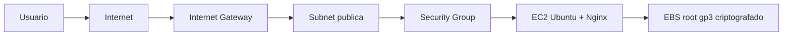
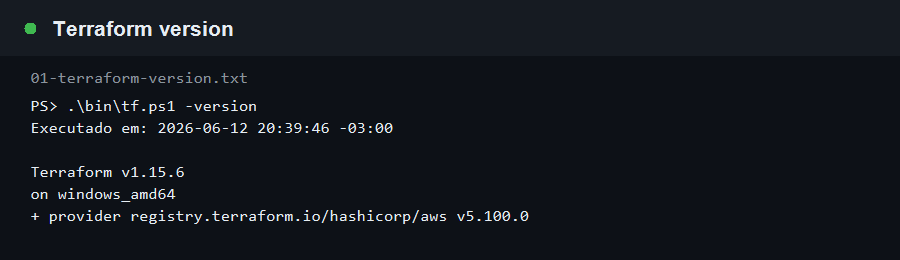
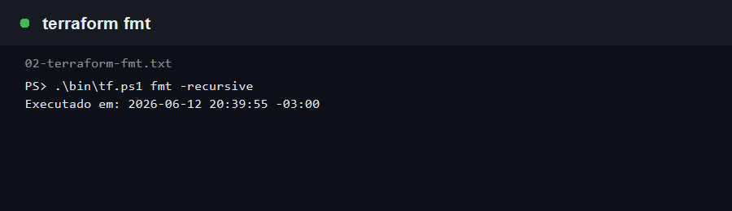
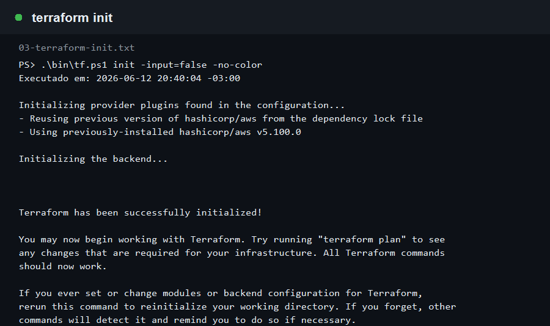
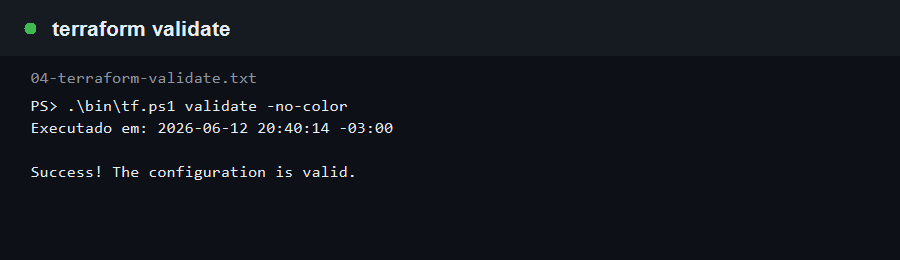
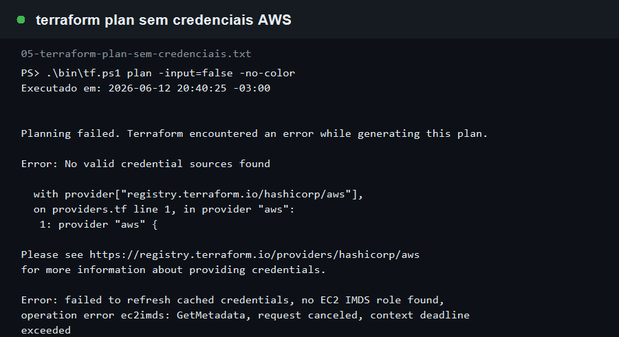

# Ponderada Terraform - IaC na AWS

Este repositorio documenta a execucao do fluxo inicial de Terraform para AWS, seguindo o tutorial da HashiCorp e indo um pouco alem dele com uma rede propria, tags, variaveis, outputs e uma instancia EC2 com Nginx instalado automaticamente.

## Status da execucao

Data da execucao local: 2026-06-12.

O Terraform foi instalado localmente, o provider AWS foi inicializado, a configuracao foi formatada e validada com sucesso. O `terraform plan` real ficou bloqueado porque esta maquina nao possui credenciais AWS configuradas. Por isso, a criacao efetiva dos recursos na nuvem ainda depende de autenticar uma conta AWS e executar `terraform plan/apply`.

## Objetivo

Criar infraestrutura como codigo para provisionar um ambiente simples na AWS:

- VPC propria para isolar a entrega.
- Subnet publica com saida para internet.
- Internet Gateway e Route Table publica.
- Security Group com HTTP aberto e SSH opcional.
- Instancia EC2 Ubuntu usando AMI buscada dinamicamente.
- Nginx instalado via `user_data`, expondo uma pagina simples de validacao.

## Arquitetura



## Estrutura do projeto

```text
.
|-- cloud-init/
|   `-- app-server.sh.tftpl
|-- docs/
|   |-- estudo-terraform.md
|   `-- evidencias/
|-- scripts/
|   |-- gerar-print-terminal.ps1
|   |-- instalar-terraform.ps1
|   `-- registrar-comando.ps1
|-- bin/
|   `-- tf.ps1
|-- versions.tf
|-- providers.tf
|-- variables.tf
|-- network.tf
|-- compute.tf
|-- outputs.tf
`-- terraform.tfvars.example
```

## Passo a passo executado

### 1. Estudo das referencias

Antes de escrever o codigo, foram consultados os materiais indicados sobre Terraform, IaC, instalacao da CLI e criacao de recursos AWS. O resumo esta em [docs/estudo-terraform.md](docs/estudo-terraform.md).

### 2. Instalacao do Terraform

Como o Terraform nao estava no PATH da maquina, foi usado um script para baixar o binario oficial da HashiCorp em `.tools/`, sem instalar nada globalmente.

```powershell
powershell -ExecutionPolicy Bypass -File scripts\instalar-terraform.ps1
.\bin\tf.ps1 -version
```

Evidencia:



### 3. Formatacao dos arquivos

O comando `fmt` aplica o padrao oficial de formatacao do Terraform.

```powershell
.\bin\tf.ps1 fmt -recursive
```

Evidencia:



### 4. Inicializacao do workspace

O `init` baixou o provider AWS e gerou o arquivo `.terraform.lock.hcl`, que deve ficar versionado para manter a reprodutibilidade.

```powershell
.\bin\tf.ps1 init -input=false -no-color
```

Evidencia:



### 5. Validacao da configuracao

O `validate` confirmou que a configuracao HCL esta consistente.

```powershell
.\bin\tf.ps1 validate -no-color
```

Evidencia:



### 6. Tentativa de planejamento

O `plan` foi executado, mas nao conseguiu consultar a AWS porque nao havia credenciais configuradas no ambiente local.

```powershell
.\bin\tf.ps1 plan -input=false -no-color
```

Evidencia:



## Como finalizar o provisionamento na AWS

Depois de configurar credenciais AWS, rode:

```powershell
Copy-Item terraform.tfvars.example terraform.tfvars
notepad terraform.tfvars

$env:AWS_ACCESS_KEY_ID="SUA_ACCESS_KEY"
$env:AWS_SECRET_ACCESS_KEY="SUA_SECRET_KEY"
$env:AWS_DEFAULT_REGION="us-west-2"

.\bin\tf.ps1 init -input=false -no-color
.\bin\tf.ps1 plan -input=false -no-color -out=tfplan
.\bin\tf.ps1 apply -input=false -no-color tfplan
.\bin\tf.ps1 output -no-color
```

Para gerar novos prints automaticamente:

```powershell
powershell -ExecutionPolicy Bypass -File scripts\registrar-comando.ps1 -Nome 06-terraform-plan -Comando ".\bin\tf.ps1 plan -input=false -no-color -out=tfplan" -Titulo "terraform plan com credenciais AWS"
powershell -ExecutionPolicy Bypass -File scripts\registrar-comando.ps1 -Nome 07-terraform-apply -Comando ".\bin\tf.ps1 apply -input=false -no-color tfplan" -Titulo "terraform apply"
powershell -ExecutionPolicy Bypass -File scripts\registrar-comando.ps1 -Nome 08-terraform-output -Comando ".\bin\tf.ps1 output -no-color" -Titulo "terraform output"
```

## Itens declarados para provisionamento

| Item | Recurso Terraform | Proposito |
| --- | --- | --- |
| VPC | `aws_vpc.main` | Isolar a rede da entrega |
| Subnet publica | `aws_subnet.public` | Hospedar a EC2 com IP publico |
| Internet Gateway | `aws_internet_gateway.main` | Permitir acesso externo |
| Route Table publica | `aws_route_table.public` | Rota `0.0.0.0/0` para internet |
| Security Group | `aws_security_group.web` | Liberar HTTP e SSH opcional |
| AMI Ubuntu | `data.aws_ami.ubuntu` | Buscar imagem Ubuntu 24.04 mais recente |
| EC2 | `aws_instance.app_server` | Servidor web da atividade |
| Disco root | `root_block_device` | Volume `gp3` criptografado |

Depois do `apply`, os outputs esperados sao:

```text
ami_id
instance_id
instance_public_ip
web_url
vpc_id
public_subnet_id
security_group_id
```

## Cuidados adotados

- `.tfvars` e `tfstate` estao no `.gitignore` para evitar vazamento de credenciais e estado.
- SSH fica fechado por padrao; para abrir, informe um IP especifico em `allowed_ssh_cidr`, como `203.0.113.10/32`.
- A EC2 usa IMDSv2 obrigatorio.
- O volume root e criptografado.
- Todos os recursos recebem tags padronizadas por `default_tags`.

## Destruicao do ambiente

Depois de registrar as evidencias da nuvem, destrua os recursos para evitar custo:

```powershell
.\bin\tf.ps1 destroy -input=false -no-color
```

## Repositorio remoto

Nesta maquina nao havia `gh` nem token GitHub configurado. Para publicar, crie um repositorio vazio no GitHub e rode:

```powershell
git remote add origin https://github.com/SEU_USUARIO/ponderada_terraform.git
git push -u origin codex/ponderada-terraform-iac
```

## Referencias

- https://www.ibm.com/br-pt/topics/terraform
- https://www.youtube.com/watch?v=0EAjJe8aPkc
- https://developer.hashicorp.com/terraform/tutorials/aws-get-started/infrastructure-as-code
- https://developer.hashicorp.com/terraform/tutorials/aws-get-started/install-cli
- https://developer.hashicorp.com/terraform/tutorials/aws-get-started/aws-create
